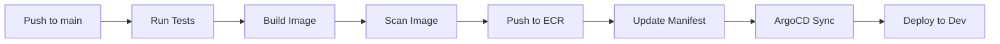

# CI/CD Pipeline

This directory contains all CI/CD configurations for the DevSecOps platform using GitHub Actions and ArgoCD.

## 📁 Directory Structure

```
05-cicd/
├── README.md                           # This file
├── github-actions/                     # GitHub Actions workflows
│   ├── user-service.yml               # User service CI/CD
│   ├── auth-service.yml               # Auth service CI/CD
│   ├── notification-service.yml       # Notification service CI/CD
│   ├── analytics-service.yml          # Analytics service CI/CD
│   ├── frontend.yml                   # Frontend CI/CD
│   ├── infrastructure.yml             # Terraform validation
│   └── security-scan.yml              # Security scanning
├── argocd/                            # ArgoCD GitOps configurations
│   ├── applications/                  # Application definitions
│   │   ├── dev/                      # Development applications
│   │   ├── staging/                  # Staging applications
│   │   └── prod/                     # Production applications
│   ├── projects.yaml                 # ArgoCD projects
│   └── app-of-apps.yaml              # App of Apps pattern
├── scripts/                           # Helper scripts
│   ├── build-all.sh                  # Build all services
│   ├── push-all.sh                   # Push all images
│   └── update-images.sh              # Update image tags
└── config/                            # CI/CD configurations
    ├── cosign/                       # Image signing config
    ├── sonarqube/                    # SonarQube config
    └── trivy/                        # Trivy config
```

## 🚀 CI/CD Pipeline Overview

### Pipeline Stages

1. **Build & Test**
   - Checkout code
   - Run unit tests
   - Build Docker images
   - Tag with commit SHA and branch

2. **Security Scanning**
   - Trivy vulnerability scanning
   - SonarQube code quality analysis
   - SAST (Static Application Security Testing)
   - License compliance checking

3. **Image Signing**
   - Sign Docker images with Cosign
   - Store signatures in OCI registry
   - Verify signatures before deployment

4. **Push to Registry**
   - Push to Amazon ECR
   - Multi-arch builds (optional)
   - Cache optimization

5. **GitOps Deployment**
   - Update image tags in manifests
   - ArgoCD auto-sync to Kubernetes
   - Health checks and rollback

### Workflow Triggers

- **Pull Request**: Build, test, scan (no deployment)
- **Push to main**: Full pipeline + deploy to dev
- **Manual dispatch**: Deploy to staging/prod with approval

## 📦 GitHub Actions Workflows

### User Service (`user-service.yml`)
- Go tests and linting
- Docker build and push
- Trivy scanning
- Deploy to dev on merge to main

### Auth Service (`auth-service.yml`)
- Node.js tests and linting
- Docker build and push
- npm audit
- Deploy to dev on merge to main

### Notification Service (`notification-service.yml`)
- Python tests and linting
- Docker build and push
- Safety vulnerability scan
- Deploy to dev on merge to main

### Analytics Service (`analytics-service.yml`)
- Java tests and Maven build
- Docker build and push
- OWASP dependency check
- Deploy to dev on merge to main

### Frontend (`frontend.yml`)
- TypeScript build and tests
- Vite production build
- Docker build and push
- Deploy to dev on merge to main

### Infrastructure (`infrastructure.yml`)
- Terraform format check
- Terraform validate
- Terraform plan
- Terraform apply (with approval)

### Security Scan (`security-scan.yml`)
- Scheduled security scans
- Vulnerability reporting
- Dependency updates

## 🔄 ArgoCD GitOps

### Application Structure

Each service has three ArgoCD Applications:
- `{service}-dev` - Development environment
- `{service}-staging` - Staging environment
- `{service}-prod` - Production environment

### Sync Policies

**Development**:
- Auto-sync enabled
- Self-heal enabled
- Prune resources enabled

**Staging**:
- Auto-sync enabled
- Self-heal disabled
- Manual prune

**Production**:
- Manual sync
- Manual approval required
- No auto-heal
- Manual prune

### Health Checks

ArgoCD monitors:
- Deployment rollout status
- Pod readiness
- Service endpoints
- Ingress status

## 🔐 Secrets Management

### GitHub Secrets Required

```bash
# AWS Credentials
AWS_ACCESS_KEY_ID
AWS_SECRET_ACCESS_KEY
AWS_REGION
AWS_ACCOUNT_ID

# ECR Repository URLs
ECR_REPOSITORY_USER_SERVICE
ECR_REPOSITORY_AUTH_SERVICE
ECR_REPOSITORY_NOTIFICATION_SERVICE
ECR_REPOSITORY_ANALYTICS_SERVICE
ECR_REPOSITORY_FRONTEND

# Cosign for image signing
COSIGN_PRIVATE_KEY
COSIGN_PASSWORD

# SonarQube
SONAR_TOKEN
SONAR_HOST_URL

# Kubernetes
KUBECONFIG_DEV
KUBECONFIG_STAGING
KUBECONFIG_PROD

# ArgoCD
ARGOCD_SERVER
ARGOCD_AUTH_TOKEN
```

### Setting Up Secrets

```bash
# Configure AWS credentials
gh secret set AWS_ACCESS_KEY_ID --body "$AWS_ACCESS_KEY_ID"
gh secret set AWS_SECRET_ACCESS_KEY --body "$AWS_SECRET_ACCESS_KEY"
gh secret set AWS_REGION --body "us-east-1"
gh secret set AWS_ACCOUNT_ID --body "123456789012"

# Generate Cosign key pair
cosign generate-key-pair
gh secret set COSIGN_PRIVATE_KEY < cosign.key
gh secret set COSIGN_PASSWORD --body "your-password"

# Set SonarQube token
gh secret set SONAR_TOKEN --body "your-sonar-token"
gh secret set SONAR_HOST_URL --body "https://sonarcloud.io"

# Export kubeconfig
aws eks update-kubeconfig --name devsecops-dev-eks --region us-east-1
gh secret set KUBECONFIG_DEV < ~/.kube/config
```

## 🛠️ Setup Instructions

### 1. Create ECR Repositories

```bash
# Create ECR repositories for all services
for service in user-service auth-service notification-service analytics-service frontend; do
  aws ecr create-repository \
    --repository-name $service \
    --image-scanning-configuration scanOnPush=true \
    --region us-east-1
done
```

### 2. Install ArgoCD

```bash
# Install ArgoCD
kubectl create namespace argocd
kubectl apply -n argocd -f https://raw.githubusercontent.com/argoproj/argo-cd/stable/manifests/install.yaml

# Expose ArgoCD server
kubectl patch svc argocd-server -n argocd -p '{"spec": {"type": "LoadBalancer"}}'

# Get initial admin password
kubectl -n argocd get secret argocd-initial-admin-secret -o jsonpath="{.data.password}" | base64 -d

# Login to ArgoCD
argocd login <ARGOCD_SERVER>
argocd account update-password
```

### 3. Configure ArgoCD

```bash
# Add repository
argocd repo add https://github.com/khaledhawil/DevSecOps-Project.git \
  --type git \
  --name devsecops

# Create projects
kubectl apply -f argocd/projects.yaml

# Deploy applications
kubectl apply -f argocd/app-of-apps.yaml
```

### 4. Install Cosign

```bash
# Install Cosign
wget https://github.com/sigstore/cosign/releases/latest/download/cosign-linux-amd64
sudo mv cosign-linux-amd64 /usr/local/bin/cosign
sudo chmod +x /usr/local/bin/cosign

# Generate key pair
cosign generate-key-pair
```

### 5. Configure GitHub Actions

```bash
# Install GitHub CLI
sudo apt install gh

# Authenticate
gh auth login

# Set all required secrets (see Secrets Management section above)
```

## 🔍 Monitoring CI/CD

### GitHub Actions Dashboard
- View workflow runs: `https://github.com/khaledhawil/DevSecOps-Project/actions`
- Check build status badges
- Review security scan results

### ArgoCD Dashboard
- Access: `https://<ARGOCD_SERVER>`
- View sync status
- Check application health
- Review sync history

### Slack Notifications (Optional)

```yaml
- name: Notify Slack
  uses: 8398a7/action-slack@v3
  with:
    status: ${{ job.status }}
    text: 'Deployment completed'
    webhook_url: ${{ secrets.SLACK_WEBHOOK }}
  if: always()
```

## 📊 Deployment Flow

### Development Deployment


### Staging Deployment
1. Trigger workflow manually
2. Build and scan
3. Push to ECR with staging tag
4. Update staging manifests
5. Manual approval required
6. ArgoCD syncs to staging

### Production Deployment
1. Create release tag
2. Trigger production workflow
3. Build and scan
4. Push to ECR with version tag
5. Multiple approval gates
6. Blue-green deployment (optional)
7. Manual ArgoCD sync
8. Health verification
9. Rollback on failure

## 🔄 Rollback Procedures

### GitHub Actions Rollback
```bash
# Revert image tag in manifests
cd 04-kubernetes/overlays/prod
kustomize edit set image user-service=<ECR>/user-service:v1.0.0
git commit -m "Rollback to v1.0.0"
git push
```

### ArgoCD Rollback
```bash
# Rollback via CLI
argocd app rollback user-service-prod

# Rollback via UI
# Navigate to application -> History -> Select revision -> Rollback
```

### Kubernetes Rollback
```bash
# Rollback deployment
kubectl rollout undo deployment/user-service-prod -n devsecops-prod

# Rollback to specific revision
kubectl rollout undo deployment/user-service-prod -n devsecops-prod --to-revision=2
```

## 🎯 Best Practices

1. **Always run tests** before merging to main
2. **Scan images** for vulnerabilities before deployment
3. **Use semantic versioning** for releases
4. **Tag images** with commit SHA for traceability
5. **Sign images** for supply chain security
6. **Use approval gates** for production
7. **Monitor deployments** in ArgoCD
8. **Keep secrets secure** in GitHub Secrets
9. **Review security scan results** regularly
10. **Document deployment procedures**

## 🆘 Troubleshooting

### Workflow Fails to Push to ECR
```bash
# Check ECR repository exists
aws ecr describe-repositories --repository-names user-service

# Verify AWS credentials
aws sts get-caller-identity

# Check IAM permissions
aws iam get-user
```

### ArgoCD Sync Fails
```bash
# Check application status
argocd app get user-service-dev

# View detailed logs
kubectl logs -n argocd deployment/argocd-application-controller

# Manually sync
argocd app sync user-service-dev --force
```

### Image Pull Errors
```bash
# Check ECR login
aws ecr get-login-password --region us-east-1 | docker login --username AWS --password-stdin <ACCOUNT_ID>.dkr.ecr.us-east-1.amazonaws.com

# Verify image exists
aws ecr describe-images --repository-name user-service

# Check pod events
kubectl describe pod <pod-name> -n devsecops-dev
```

## 📚 Additional Resources

- [GitHub Actions Documentation](https://docs.github.com/en/actions)
- [ArgoCD Documentation](https://argo-cd.readthedocs.io/)
- [Cosign Documentation](https://docs.sigstore.dev/cosign/overview/)
- [Trivy Documentation](https://aquasecurity.github.io/trivy/)
- [AWS ECR Documentation](https://docs.aws.amazon.com/ecr/)

---

**Status**: Ready for CI/CD implementation!
